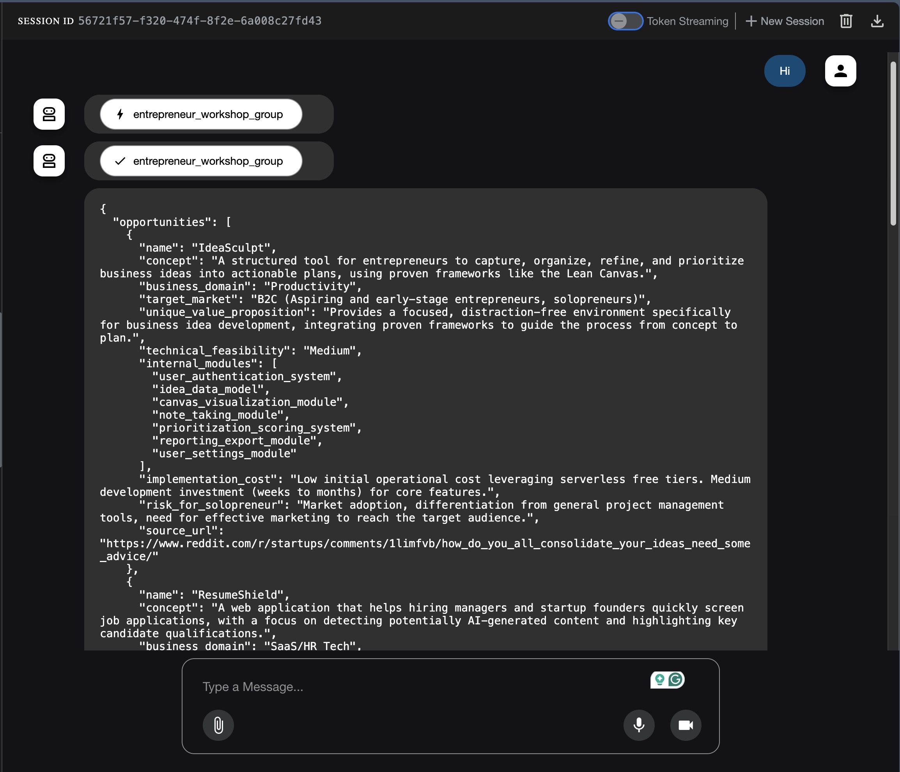
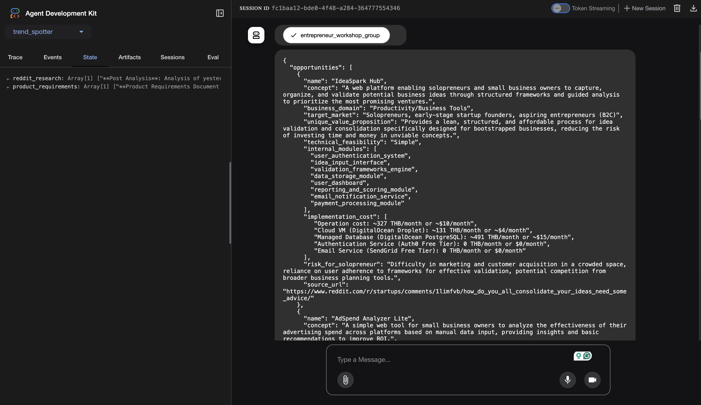

# Product Ideas Daily

A trend spotting application that analyzes Reddit posts to identify emerging product opportunities and market trends.

## Overview

This tool uses AI agents to scan Reddit subreddits for yesterday's posts and extract insights about potential product ideas, market trends, and consumer interests.

## Features

- **Reddit Analysis**: Searches specific subreddits for recent posts
- **AI-Powered Insights**: Uses Google's Gemini model to analyze trends
- **Multi-Agent Architecture**: Orchestrated agents for specialized tasks

## Requirements

- Python 3.12+
- Google ADK access
- Reddit API credentials (PRAW)

## Installation

```bash
# Install dependencies
uv sync

# Set up environment variables
cp .env.example .env
# Edit .env with your API credentials
```

## ENV Example
```properties
GOOGLE_API_KEY=your_google_api_key
REDDIT_CLIENT_ID=your_reddit_client_id
REDDIT_CLIENT_SECRET=your_reddit_client_secret
REDDIT_USER_AGENT=your_reddit_user_agent
```

## Usage

```bash
adk web
```

## Example Output

The application analyzes Reddit posts and generates structured product opportunity reports:




The AI orchestrator coordinates multiple specialist agents to:
1. **Reddit Agent**: Scans subreddits for consumer pain points and discussions
2. **Google Search Agent**: Researches pricing for cloud services and technical components  
3. **Solution Architect Agent**: Evaluates technical feasibility and implementation costs

The final output provides the top 6 product opportunities with market validation, technical analysis, and cost breakdowns.

## Dependencies

- `google-adk`: Agent Development Kit
- `praw`: Python Reddit API Wrapper


## Prepare env

```bash
# Set to False to use Gemini
export GOOGLE_GENAI_USE_VERTEXAI=False

# Set your Google Cloud Project ID
export GOOGLE_CLOUD_PROJECT="tpc-ai-agent"

# Set your desired Google Cloud Location
export GOOGLE_CLOUD_LOCATION="asia-northeast1" # Example location

# Set the path to your agent code directory
export AGENT_PATH="./trend_spotter"

# Set a name for your Cloud Run service (optional)
export SERVICE_NAME="product-ideas-daily"

# Set an application name (optional)
export APP_NAME="product-ideas-daily"

# After testing it locally, set your related env when deployment
export GEMINI_API_KEY="SET_YOUR_GEMINI_API_KEY"
export REDDIT_CLIENT_ID="SET_YOUR_REDDIT_CLIENT_ID"
export REDDIT_CLIENT_SECRET="SET_YOUR_REDDIT_CLIENT_SECRET"
export REDDIT_USER_AGENT="SET_YOUR_REDDIT_USER_AGENT"
```

## Deploy to Google Cloud

```bash
gcloud run deploy product-ideas-daily \
--source . \
--region $GOOGLE_CLOUD_LOCATION \
--project $GOOGLE_CLOUD_PROJECT \
--allow-unauthenticated \
--set-env-vars="GOOGLE_CLOUD_PROJECT=$GOOGLE_CLOUD_PROJECT,GOOGLE_CLOUD_LOCATION=$GOOGLE_CLOUD_LOCATION,GOOGLE_GENAI_USE_VERTEXAI=$GOOGLE_GENAI_USE_VERTEXAI,GEMINI_API_KEY=$GEMINI_API_KEY,REDDIT_CLIENT_ID=$REDDIT_CLIENT_ID,REDDIT_CLIENT_SECRET=$REDDIT_CLIENT_SECRET,REDDIT_USER_AGENT=$REDDIT_USER_AGENT"
```